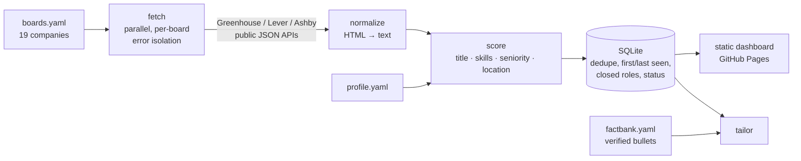

# jobradar

[](https://github.com/SnigdhaSrivastva/jobradar/actions/workflows/ci.yml)
[](https://github.com/SnigdhaSrivastva/jobradar/actions/workflows/daily.yml)


**▶ Live dashboard: [snigdhasrivastva.github.io/jobradar](https://snigdhasrivastva.github.io/jobradar/)** (refreshed daily)

jobradar watches company career pages, ranks every open role by an **explainable fit score** against your profile, and builds a tailored resume for any role using **only bullets you've already verified**. It reads the official public job-board APIs of Greenhouse, Lever and Ashby. It never applies, submits or logs in anywhere.

On its first real run it pulled **5,939 open roles from 19 companies in 81 seconds**.

## How it works



### Explainable scoring (0–100)

Every point traces to a reason shown on the dashboard:

| Component | Max | How |
|---|---|---|
| Title | 30 | Best word overlap with a target title. Avoided titles (intern, manager, iOS…) are excluded, matching **whole words**, so "Internal Tools" isn't caught by "intern". |
| Skills | 45 | Weighted share of your skills the posting mentions, with aliases (k8s → Kubernetes, ETL → Data pipelines) and word boundaries that stop "Java" matching "JavaScript". **Core** skills that aren't mentioned are flagged. |
| Seniority | 15 | Parses "N+ years" requirements. Full credit when within reach, tapering to zero 3 years above your experience. |
| Location | 10 | Remote, or one of your preferred locations |

### Grounded tailoring

`jobradar tailor <job>` ranks your **fact bank**, a list of verified, pre-written bullets tagged with the skills they prove, by how many of the posting's skills each bullet evidences. Output bullets are the fact-bank entries themselves, so the resume **can't claim anything you haven't verified**. A `verify_grounded` check enforces this, and the command lists the posting's skills that none of your bullets cover.

```text
$ jobradar tailor greenhouse:Coinbase:7812407
Senior Software Engineer - Data Platform @ Coinbase

- Built Kafka consumers that process 18,000+ events/min with exactly-once effects ...
- Designed Spring Boot services on PostgreSQL and Redis handling 1.2M+ transactions per day ...
- Wrote Python and SQL ETL pipelines feeding analytics marts, with data-quality gates ...
...
emphasized: data pipelines, distributed systems, java, kafka, llms, observability, python, spark, sql
not evidenced by any bullet: -
```

### Tracking across runs

The SQLite store dedupes postings across daily runs and records first and last seen. It **closes roles that disappear** from a board that fetched successfully; a board that's temporarily down never closes its jobs. Application status (`saved → applied → interviewing → offer`) survives every refresh.

## Usage

```bash
pip install -e .
jobradar fetch                          # boards in example/boards.yaml, scored with example/profile.yaml
jobradar top -n 20                      # best current matches
jobradar tailor <job-key>               # pick verified bullets for that posting
jobradar status <job-key> applied       # track it
jobradar report --out site/index.html   # static dashboard
```

To use it yourself, copy the files in `example/` and edit your target titles, skills (weights, aliases, core flags), years of experience, preferred locations, and fact bank.

## Tests

`pytest` runs 35 tests (96% coverage):
- parsers run against **real recorded API payloads** from each platform
- double-escaped HTML handling
- isolating a failing board
- scoring edge cases: word boundaries, aliases, years parsing, avoid-list
- tailoring is always grounded
- store idempotency, closures, status persistence
- the dashboard safely escapes job titles that contain `</script>`
- the CLI end to end

CI also runs ruff and strict mypy.

## Tech

Python 3.11 · httpx · Pydantic v2 · SQLite · PyYAML · pytest · ruff · mypy (strict) · GitHub Actions (CI + scheduled scan) · GitHub Pages
